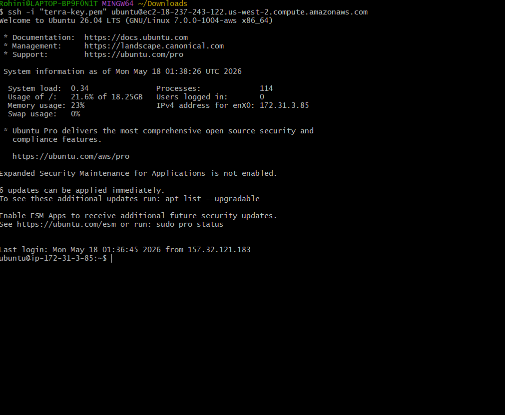
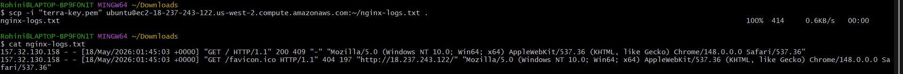

# Day 08 – Cloud Server Setup: Docker, Nginx & Web Deployment

# Launch Cloud Instance

- Created AWS EC2 Ubuntu instance
- Connected using SSH key pair
- Allowed ports:
  - 22 (SSH)
  - 80 (HTTP)

---

# SSH Connection

## Connect to Server

```bash
ssh -i three-tier-app-key.pem ubuntu@<public-ip>
```

Successfully connected to EC2 instance.



---

# Update System

```bash
sudo apt update && sudo apt upgrade -y
```

Updated all system packages.

---

# Install Docker

```bash
curl -fsSL https://get.docker.com -o install-docker.sh
sudo sh install-docker.sh
```

Verified Docker installation:

```bash
docker --version
```

---

# Install Nginx

```bash
sudo apt install nginx -y
```

Start and enable Nginx:

```bash
sudo systemctl enable nginx
sudo systemctl start nginx
```

Verify service status:

```bash
sudo systemctl status nginx
```

---

# Verify Web Access

Opened browser using:

```text
http://<public-ip>
```

Successfully accessed Nginx welcome page.


---

# Extract Nginx Logs

## View Logs

```bash
sudo tail -n 20 /var/log/nginx/access.log
```

---

## Save Logs to File

```bash
sudo cat /var/log/nginx/access.log > nginx-logs.txt
```

---

## Download Logs to Local Machine

```bash
scp -i three-tier-app-key.pem ubuntu@<public-ip>:~/nginx-logs.txt .
```

Successfully downloaded log file.



---

# Commands Used

```bash
ssh
sudo apt update
docker --version
sudo systemctl status nginx
tail -n 20 /var/log/nginx/access.log
scp
```

---

# Challenges Faced

## Port 80 Not Accessible

- Nginx webpage initially not opening
- Fixed by allowing HTTP port 80 in AWS Security Group

---

## SSH Permission Error

- Faced permission denied for key file
- Fixed using:

```bash
chmod 400 three-tier-app-key.pem
```

---

# What I Learned

- How to launch and connect to a cloud server
- How to install Docker and Nginx
- How to configure AWS Security Groups
- How to access logs from Linux servers
- Basic cloud server management and troubleshooting
