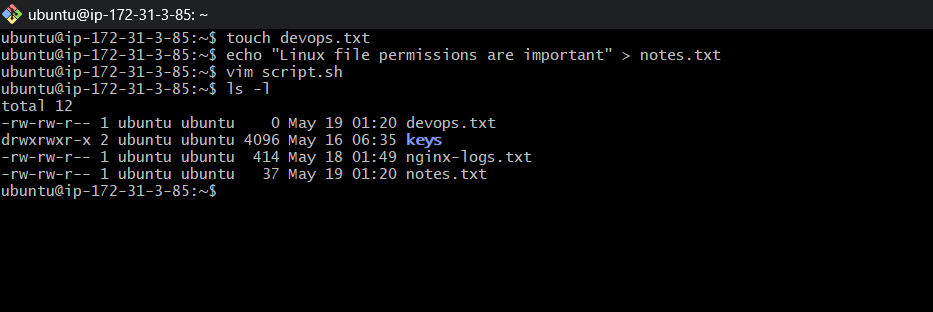
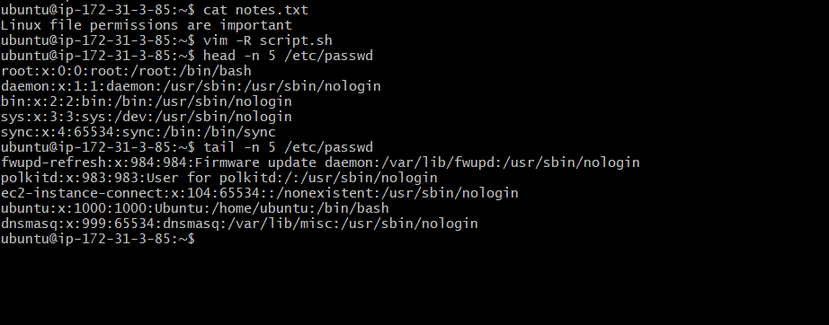
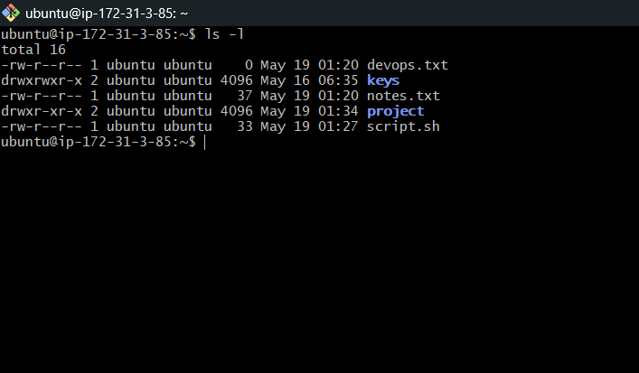
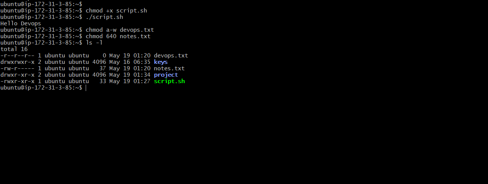
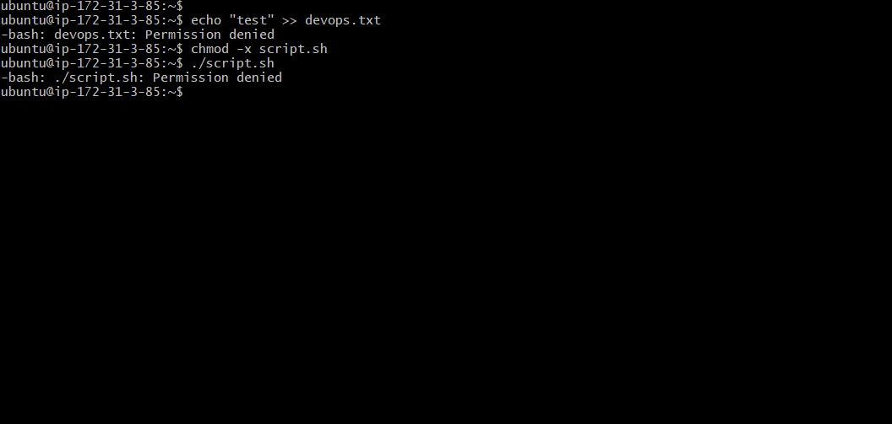

# Day 10 Challenge

# Files Created

- devops.txt
- notes.txt
- script.sh
- project/

---

# Task 1: Create Files

## Create Empty File

```bash
touch devops.txt
```
## Create File with Content

```bash
echo "Linux file permissions are important" > notes.txt
```
## Create Script File

```bash
vim script.sh
```

Added content:

```bash
echo "Hello DevOps"
```

## Verify Files

```bash
ls -l
```


---

# Task 2: Read Files

## Read notes.txt

```bash
cat notes.txt
```
## Open script.sh in Read-Only Mode

```bash
vim -R script.sh
```
## Display First 5 Lines

```bash
head -n 5 /etc/passwd
```
## Display Last 5 Lines

```bash
tail -n 5 /etc/passwd
```



---

# Task 3: Understand Permissions

## Check File Permissions

```bash
ls -l devops.txt notes.txt script.sh
```

Observed:
- `rw-r--r--` → owner can read/write
- group and others can only read
- execute permission not available initially



---

# Task 4: Modify Permissions

## Make script.sh Executable

```bash
chmod +x script.sh
```

Run script:

```bash
./script.sh
```

## Make devops.txt Read-Only

```bash
chmod a-w devops.txt
```

## Set notes.txt Permission to 640

```bash
chmod 640 notes.txt
```

Meaning:
- Owner → read/write
- Group → read only
- Others → no access

## Create Directory with 755 Permission

```bash
mkdir project
chmod 755 project
```

## Verify Permission Changes

```bash
ls -l
```



---

# Task 5: Test Permissions

## Try Writing to Read-Only File

```bash
echo "test" >> devops.txt
```

Observed:
- Permission denied error shown.

## Remove Execute Permission

```bash
chmod -x script.sh
```

Try executing:

```bash
./script.sh
```

Observed:
- Permission denied because execute permission removed.



---

# Commands Used

```bash
touch
echo
cat
vim
head
tail
chmod
mkdir
ls
```

---

# What I Learned

- How Linux file permissions work
- Difference between read, write, and execute permissions
- How chmod changes file access
- Importance of execute permission for scripts
