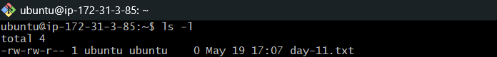
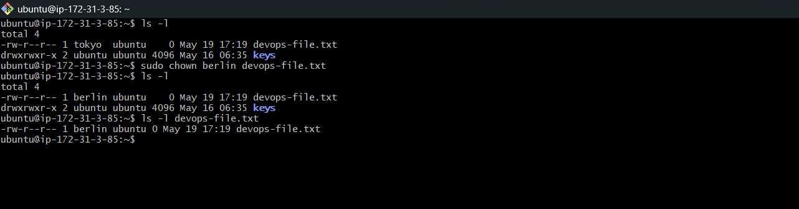
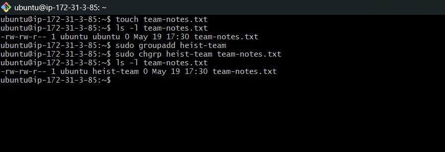
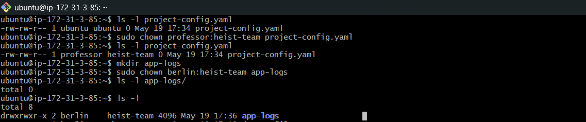
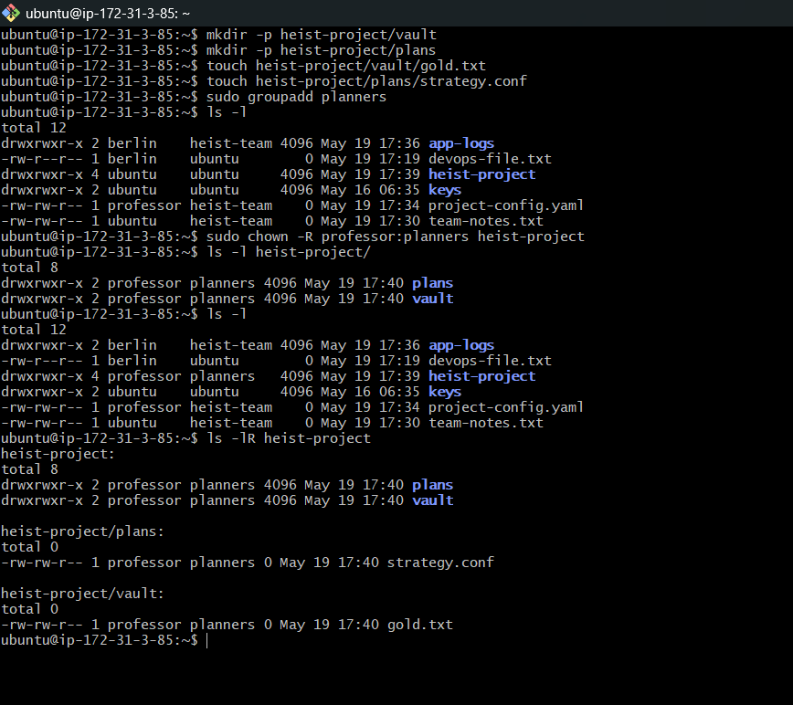
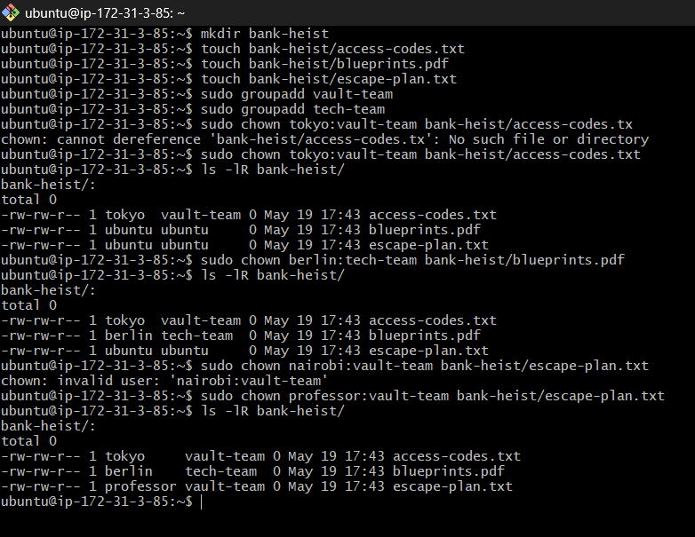

# Day 11 Challenge

# Task 1: Understanding Ownership

## Check File Ownership

```bash
ls -l
```

Observed:
- First column shows permissions
- Second column shows owner
- Third column shows group

Format:

```text
-rw-r--r-- 1 owner group size date filename
```

Difference:
- Owner → user who owns the file
- Group → users belonging to same group can access file based on permissions



---

# Task 2: Basic chown Operations

## Create File

```bash
touch devops-file.txt
```

## Check Current Owner

```bash
ls -l devops-file.txt
```
## Change Owner to tokyo

```bash
sudo chown tokyo devops-file.txt
```
## Change Owner to berlin

```bash
sudo chown berlin devops-file.txt
```

## Verify Ownership

```bash
ls -l devops-file.txt
```



---

# Task 3: Basic chgrp Operations

## Create File

```bash
touch team-notes.txt
```

## Check Current Group

```bash
ls -l team-notes.txt
```
## Create Group

```bash
sudo groupadd heist-team
```
## Change File Group

```bash
sudo chgrp heist-team team-notes.txt
```
## Verify Group Change

```bash
ls -l team-notes.txt
```



---

# Task 4: Combined Owner & Group Change

## Create File

```bash
touch project-config.yaml
```

## Change Owner and Group Together

```bash
sudo chown professor:heist-team project-config.yaml
```
## Create Directory

```bash
mkdir app-logs
```
## Change Directory Ownership

```bash
sudo chown berlin:heist-team app-logs
```



---

# Task 5: Recursive Ownership

## Create Directory Structure

```bash
mkdir -p heist-project/vault

mkdir -p heist-project/plans

touch heist-project/vault/gold.txt

touch heist-project/plans/strategy.conf
```
## Create Group

```bash
sudo groupadd planners
```
## Recursive Ownership Change

```bash
sudo chown -R professor:planners heist-project
```
## Verify Changes

```bash
ls -lR heist-project
```



---

# Task 6: Practice Challenge

## Create Directory

```bash
mkdir bank-heist
```
## Create Files

```bash
touch bank-heist/access-codes.txt

touch bank-heist/blueprints.pdf

touch bank-heist/escape-plan.txt
```
## Create Groups

```bash
sudo groupadd vault-team

sudo groupadd tech-team
```
## Set Ownership

### access-codes.txt

```bash
sudo chown tokyo:vault-team bank-heist/access-codes.txt
```
### blueprints.pdf

```bash
sudo chown berlin:tech-team bank-heist/blueprints.pdf
```
### escape-plan.txt

```bash
sudo chown nairobi:vault-team bank-heist/escape-plan.txt
```
## Verify Final Ownership

```bash
ls -l bank-heist/
```



---

# Commands Used

```bash
ls
touch
mkdir
chown
chgrp
groupadd
useradd
```

---

# What I Learned

- Difference between owner and group ownership
- How chown changes file owner
- How chgrp changes group ownership
- How recursive ownership works using -R
- Importance of ownership in Linux systems
