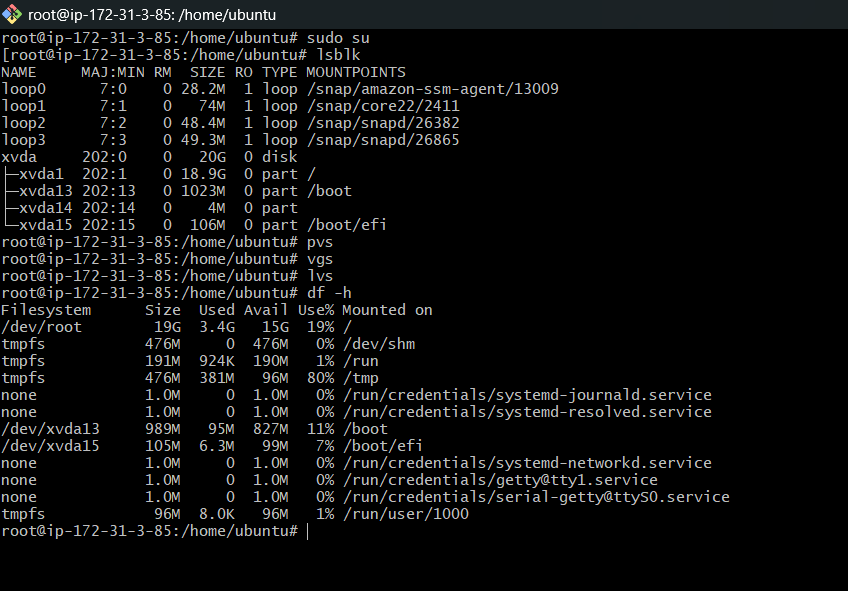
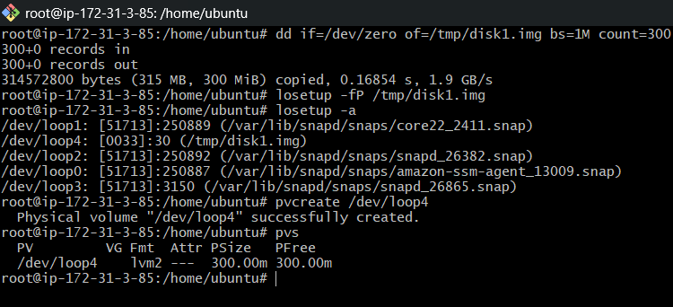
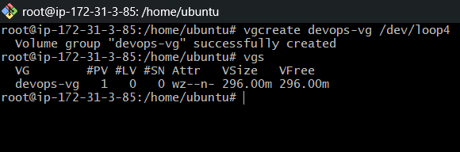
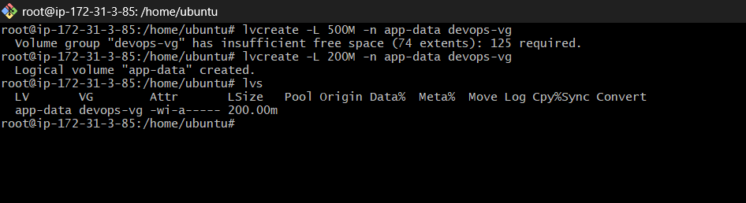
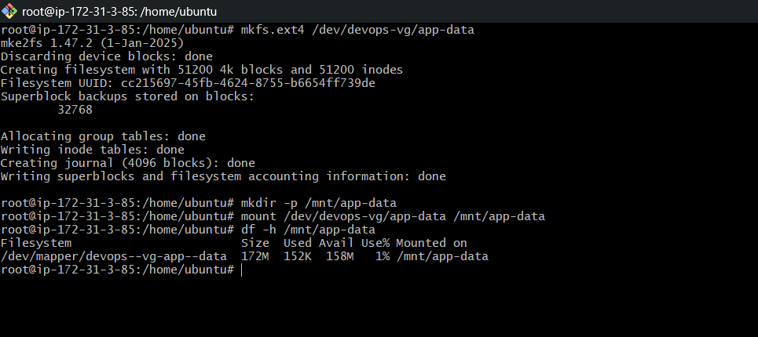
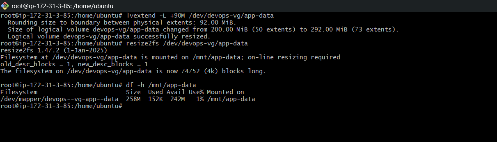

# Day 13 – Linux Volume Management (LVM)

# Task 1: Check Current Storage

## Check Block Devices

```bash
lsblk
```

## Check Physical Volumes

```bash
pvs
```
## Check Volume Groups

```bash
vgs
```
## Check Logical Volumes

```bash
lvs
```
## Check Disk Usage

```bash
df -h
```



---

# Task 2: Create Physical Volume

## Create Virtual Disk

```bash
dd if=/dev/zero of=/tmp/disk1.img bs=1M count=300
```
## Attach Loop Device

```bash
losetup -fP /tmp/disk1.img
```
## Verify Loop Device

```bash
losetup -a
```
## Create Physical Volume

```bash
pvcreate /dev/loop4
```
## Verify Physical Volume

```bash
pvs
```



---

# Task 3: Create Volume Group

## Create Volume Group

```bash
vgcreate devops-vg /dev/loop4
```
## Verify Volume Group

```bash
vgs
```


---

# Task 4: Create Logical Volume

## Create Logical Volume

```bash
lvcreate -L 300M -n app-data devops-vg
```
## Verify Logical Volume

```bash
lvs
```



---

# Task 5: Format and Mount

## Format Logical Volume

```bash
mkfs.ext4 /dev/devops-vg/app-data
```
## Create Mount Directory

```bash
mkdir -p /mnt/app-data
```
## Mount Logical Volume

```bash
mount /dev/devops-vg/app-data /mnt/app-data
```

## Verify Mounted Storage

```bash
df -h /mnt/app-data
```



---

# Task 6: Extend the Volume

## Extend Logical Volume

```bash
lvextend -L +90M /dev/devops-vg/app-data
```
## Resize Filesystem

```bash
resize2fs /dev/devops-vg/app-data
```
## Verify Extended Storage

```bash
df -h /mnt/app-data
```



---

# Commands Used

```bash
lsblk
pvs
vgs
lvs
df -h
pvcreate
vgcreate
lvcreate
mkfs.ext4
mount
lvextend
resize2fs
```

---

# What I Learned

- How Linux LVM works
- Difference between PV, VG, and LV
- How to create and mount logical volumes
- How to extend storage without repartitioning
- Importance of flexible storage management in Linux
